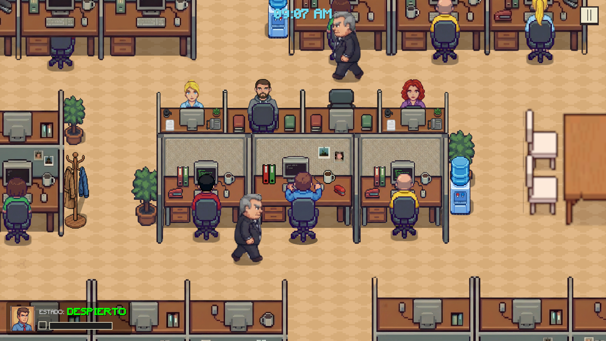
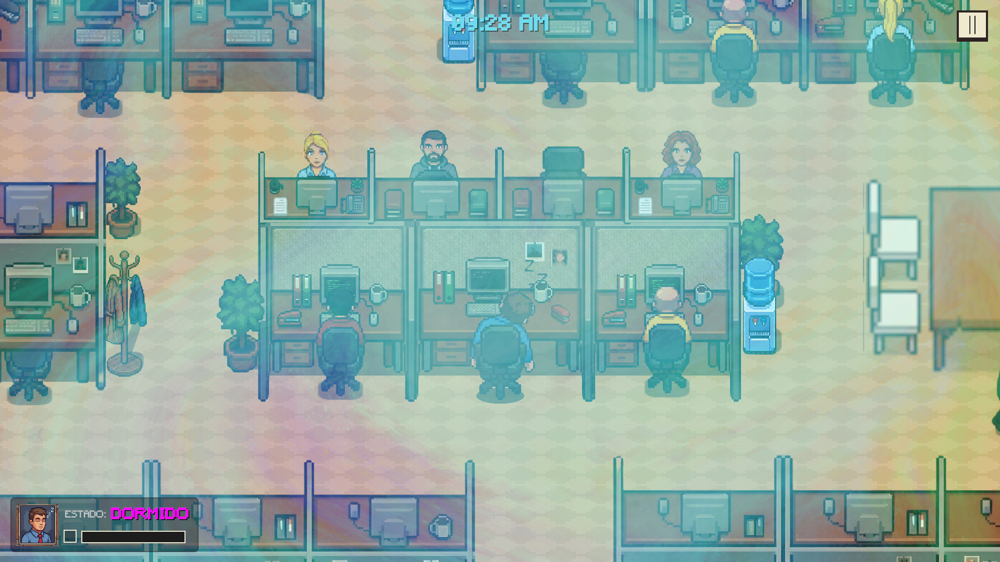

# Office Dreamer
*"¡Es tan dificil que puedo realizarlo con los ojos cerrados!"*

---

**Office Dreamer** es un juego de sigilo y gestión de tareas en Pixel Art 2D con vista superior.  

Tomas el papel de un oficinista agotado que ha descubierto que **es infinitamente más productivo cuando está sonámbulo**.  

Tu objetivo es completar tus tareas de oficina antes de que termine el día. El problema es que hacerlo despierto es lento y tedioso. Para ganar, debes **dormirte estratégicamente para acelerar el trabajo**, esquivando la vigilancia de tu jefe.

## Mecánicas Principales

### Sistema de Dualidad (Wake vs. Sleep)
El núcleo del juego reside en cambiar entre dos estados:

| Estado | Visual | Tareas | Peligro |
|--------|--------|--------|---------|
| Despierto | Oficina aburrida. | Lentas, difíciles y aburridas. | Bajo. No te despiden. |
| Dormido | Filtro psicodélico y onírico. | Rápidas, automáticas y divertidas. | Alto. Te pueden despedir. |

- **Modo Normal**

  

- **Modo Sueño**  

  

## Controles
- **Click Izquierdo**: Abrir la tarea.  
- **Barra Espaciadora**: Dormir / Despertar (Cambio de fase).

## Tareas Disponibles

Darle click al icono de *portafolio* o *perdorador* para acceder a los siguientes tareas (minijuegos):

- **Ordenar portafolios**
- **Perforar documentos**

## Instalación y Ejecución

1. Descargar el juego desde el siguiente Link : [Descarga](https://www.mediafire.com/file/0yny7zdv9zszk30/Build.zip/file)
2. Descomprimir el archivo **Build.zip**
3. Ejecutar la aplicacion **Office Dreamer**

---

## Contribuidores

- **[Jharvy Jonas Cadillo Tarazona](https://github.com/Jharvichu)** – Arte, UI, Integracion  
- **[Pedro Antonio Alfaro Vargas](https://github.com/pv4r)** – Arte, Programacion IA 
- **[Diego Edson Bayes Santos](https://github.com/FixerCoda)** – Programacion Player, Managers
- **[Luis ALberto Alanya Campos](https://github.com/AlbeCamp21)** – Audio, Programacion Minijuegos
